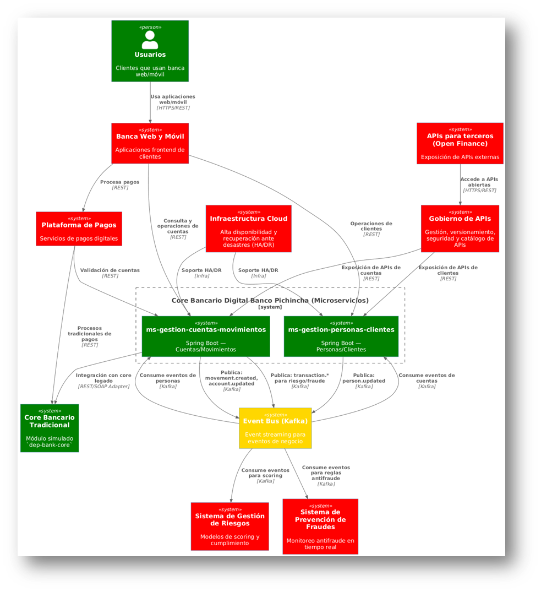
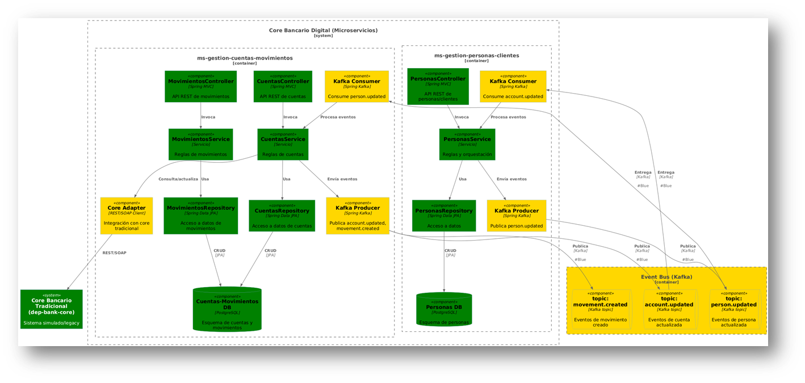
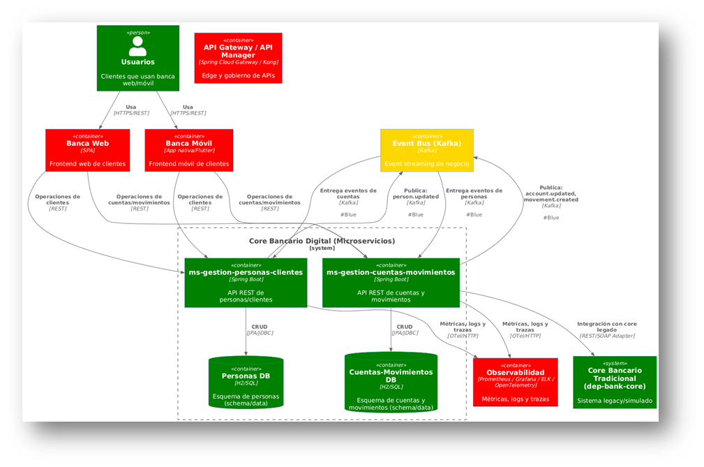

# Solución Backend para Banking: Microservicios Gestión de Clientes y Movimientos de Cuentas

Este repositorio contiene dos servicios desarrollados con **Spring Boot** orientados al manejo de información financiera y de usuarios. Los módulos incluidos son:

- `ms-gestion-personas-clientes`: administra los datos de clientes.
- `ms-gestion-cuentas-movimientos`: gestiona las cuentas bancarias y sus movimientos asociados.

Ambos microservicios emplean **Kafka** para la mensajería asincrónica y **PostgreSQL** como sistema de almacenamiento de datos relacional.

---

## Prerrequisitos

Para ejecutar correctamente los servicios, asegúrate de contar con lo siguiente:

- **Java 21**
- **Maven**
- **Docker** y **Docker Compose**
- Herramientas para pruebas como **Postman** o **cURL**

---

## Diagramas y arquitectura de Integración C4
### Documentación del Reto Técnico
[Reto Técnico - Arquitectura de Integración - ADM9558535.pdf](docs/Reto%20T%C3%A9cnico%20-%20Arquitectura%20de%20Integraci%C3%B3n%20-%20ADM9558535.pdf)

### Diagrama de Contexto


### Diagrama de Componentes


### Diagrama de Contenedores


---

## Puesta en marcha

### 1. Clona el repositorio

```bash
git clone https://github.com/Punkistein8/java-technical-bank-test.git
cd java-technical-bank-test
```

### 2. Levantar dependencias

2.1 Primero ejecuta la build de los contenedores sin la cache para evitar problemas de versiones:

```bash
docker-compose build --no-cache
```

2.2 Ejecuta los contenedores necesarios, incluyendo la base de datos PostgreSQL, Zookeeper, Kafka y los microservicios:

```bash
docker-compose up -d bank_db zookeeper kafka  ms-gestion-cuentas-movimientos ms-gestion-personas-clientes
```

### 3. Validación

3.1 Verifica que ambos servicios estén operativos observando los logs del terminal, desde el IDE o mediante Docker.

```bash
docker-compose logs -f ms-gestion-personas-clientes ms-gestion-cuentas-movimientos
```

---

## Documentación de APIs

### 🚀 Api pública Postman
Puedes importar la colección de Postman para probar los servicios de forma interactiva. Aquí tienes el enlace directo:
[Endpoints Arq Integracion](https://www.postman.com/hispasat-team/arquitectura-integracion-tcs/overview)


### 📌 Servicio de Clientes (`ms-gestion-personas-clientes`)

- **Puerto**: `8080`
- **Base URL**: `http://localhost:8080`

#### 🔹 Obtener listado de clientes

```
GET /clientes/getAll
```

```bash
curl http://localhost:8080/clientes/getAll
```

#### 🔹 Filtrar por estado

```
GET /clientes/getAllByEstado?estado=true
```

```bash
curl http://localhost:8080/clientes/getAllByEstado?estado=true
```

#### 🔹 Consultar por ID

```
GET /clientes/{id}
```

```bash
curl http://localhost:8080/clientes/1
```

#### 🔹 Crear un nuevo cliente

```
POST /clientes/create
```

```bash
curl -X POST http://localhost:8080/clientes/create -H "Content-Type: application/json" -d '{"nombres":"Ana Gómez","genero":"FEMENINO","edad":28,"identificacion":"1723456785","direccion":"Av. Nueva 789","telefono":"0971234567","contrasenia":"pass789"}'
```

#### 🔹 Modificar información de un cliente

```
PUT /clientes/update
```

```bash
curl -X PUT http://localhost:8080/clientes/update -H "Content-Type: application/json" -d '{"clienteId":1,"nombres":"Juan Pérez Actualizado","genero":"MASCULINO","edad":31,"identificacion":"1717171712","direccion":"Calle Nueva 456","telefono":"0987654321","contrasenia":"newPass123","estado":true}'
```

#### 🔹 Desactivar cliente (eliminación lógica)

```
DELETE /clientes/{id}
```

```bash
curl -X DELETE http://localhost:8080/clientes/1
```

---

### 📌 Servicio Financiero (`ms-gestion-cuentas-movimientos`)

- **Puerto**: `8081`
- **Base URL**: `http://localhost:8081`

#### 🔹 Ver todas las cuentas

```
GET /cuentas/getAll
```

```bash
curl http://localhost:8081/cuentas/getAll
```

#### 🔹 Buscar cuenta por número

```
GET /cuentas/{numCuenta}
```

```bash
curl http://localhost:8081/cuentas/1234567890
```

#### 🔹 Registrar una cuenta

```
POST /cuentas/create
```

```bash
curl -X POST http://localhost:8081/cuentas/create -H "Content-Type: application/json" -d '{"tipoCuenta":"AHORRO","saldoInicial":500.00,"estado":true,"clienteId":1}'
```

#### 🔹 Listado completo de movimientos

```
GET /movimientos
```

```bash
curl http://localhost:8081/movimientos
```

#### 🔹 Movimientos por número de cuenta

```
GET /movimientos/cuenta/{numCuenta}
```

```bash
curl http://localhost:8081/movimientos/cuenta/1234567890
```

#### 🔹 Buscar movimiento por ID

```
GET /movimientos/{id}
```

```bash
curl http://localhost:8081/movimientos/1
```

#### 🔹 Registrar movimiento

```
POST /movimientos
```

```bash
curl -X POST http://localhost:8081/movimientos -H "Content-Type: application/json" -d '{"cuentaNum":"1234567890","tipoMovimiento":"CREDITO 200.00","valor":200.00}'
```

#### 🔹 Generar reporte financiero

```
GET /reportes/reporte
```

```bash
curl "http://localhost:8081/reportes/reporte?clienteId=1&fechaInicio=2025-01-01&fechaFin=2025-03-31&tipoReporte=movementsByAccountAndDateRangeStrategy"
```

---

## 🧾 Consideraciones

- **Eliminación lógica**: Al desactivar un cliente, sus cuentas también se desactivan automáticamente mediante eventos Kafka.
- **Gestión de errores**:
  - `404`: recurso no encontrado.
  - `400`: entrada inválida.
  - `402`: fondos insuficientes (al crear movimientos).
- **Kafka Topics** utilizados:
  - `cliente-request`
  - `cliente-response`
  - `cliente-eliminacion-logica`

---

## 🚀 Flujo completo de uso

```bash
# Crear cliente
curl -X POST http://localhost:8080/clientes/create -H "Content-Type: application/json" -d '{"nombres":"Ana Gómez","genero":"FEMENINO","edad":28,"identificacion":"1723456785","direccion":"Av. Nueva 789","telefono":"0971234567","contrasenia":"pass789"}'

# Crear cuenta
curl -X POST http://localhost:8081/cuentas/create -H "Content-Type: application/json" -d '{"tipoCuenta":"AHORRO","saldoInicial":500.00,"estado":true,"clienteId":4}'

# Registrar movimiento
curl -X POST http://localhost:8081/movimientos -H "Content-Type: application/json" -d '{"cuentaNum":"1234567890","tipoMovimiento":"CREDITO 200.00","valor":200.00}'

# Obtener reporte
curl "http://localhost:8081/reportes/reporte?clienteId=4&fechaInicio=2025-01-01&fechaFin=2025-03-31&tipoReporte=movementsByAccountAndDateRangeStrategy"

# Eliminar cliente
curl -X DELETE http://localhost:8080/clientes/4
```
